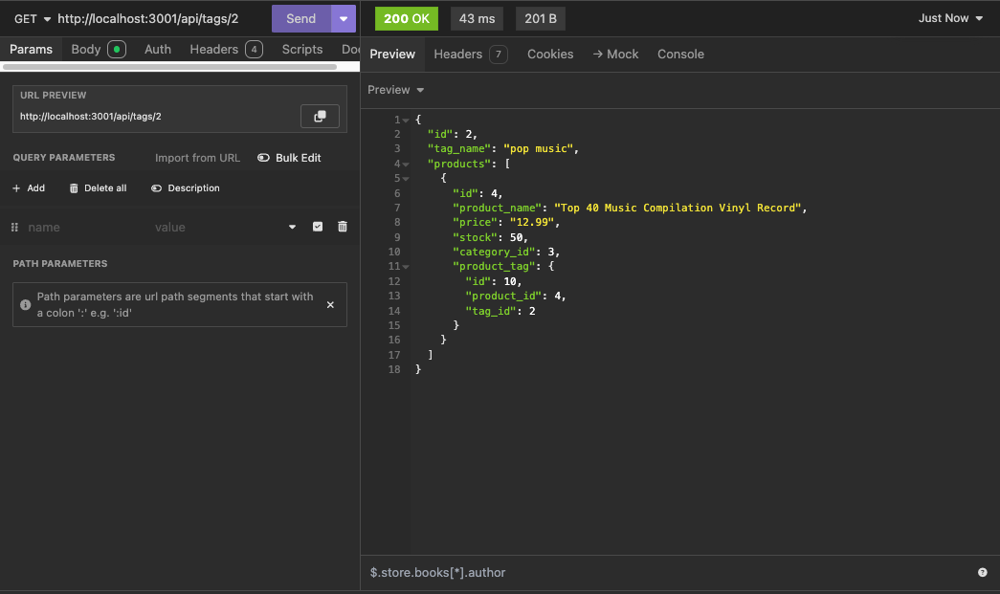
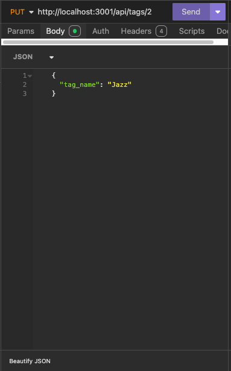
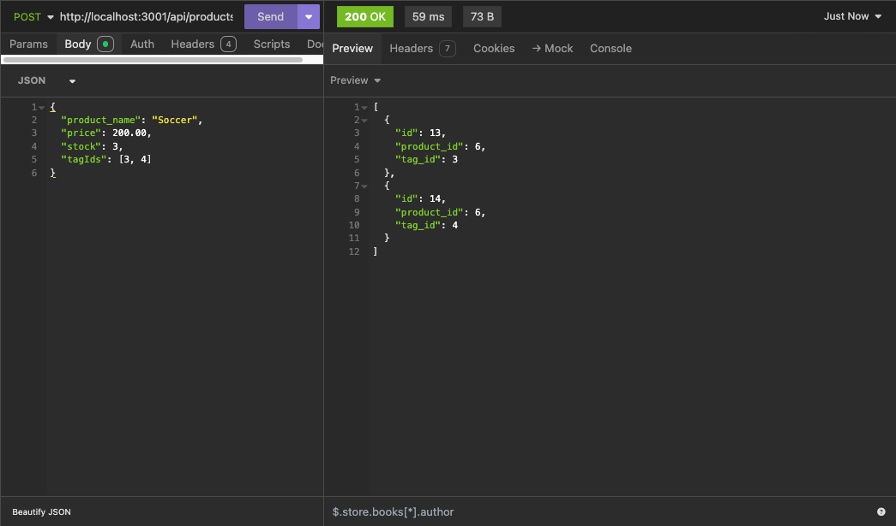

# C13-ORM-Ecommerce-BackEnd

## Project Description

This project provides a back end for an e-commerce website. The back end is built with Express.js and Sequelize, connected to a PostgreSQL database. This application allows users to managing categories, products, and tags through API routes, while supporting CRUD operations.

## Features

- Sequelize integration for PostgreSQL database
- Environment variable configuration for database connection
- Schema and seed commands for database setup
- API routes for categories, products, and tags with CRUD support
- Formatted JSON responses for API GET routes
- Error handling for API routes

## Usage

1. Add your database name, PostgreSQL username, and PostgreSQL password to an environment variable file (.env).
2. Run the schema command to create the development database.
3. Seed the database with test data using the seed command.
4. Start the server and sync the Sequelize models to the PostgreSQL database.
5. Open API GET routes in Insomnia to view data in formatted JSON.
6. Test the API POST, PUT, and DELETE routes via Insomnia or another API testing tool to manage data in the database.

## Example(s)

[Demo Video](https://drive.google.com/file/d/1BhxlD28T8R08Df3a0g7fF7vdFcAPPQYw/view)

## Source Code

- Base code + example provided by: [The Coding Bootcamp](https://github.com/coding-boot-camp/bookish-sniffle)
- Modifications by [Lixiviate](https://github.com/Lixiviate)
- Code Assistance:
  - [MDN Web Docs](https://developer.mozilla.org/en-US/)
  - [W3Schools](https://www.w3schools.com/)
  - [edX Xpert Learning Assistant](https://www.edx.org/)
- Development Resources:
  - [dotenv](https://www.npmjs.com/package/dotenv)
  - [Express.js](https://www.npmjs.com/package/express)
  - [node-postgres](https://www.npmjs.com/package/pg)
  - [PostgreSQL](https://www.postgresql.org/)

## License

This project is licensed under the MIT license.
